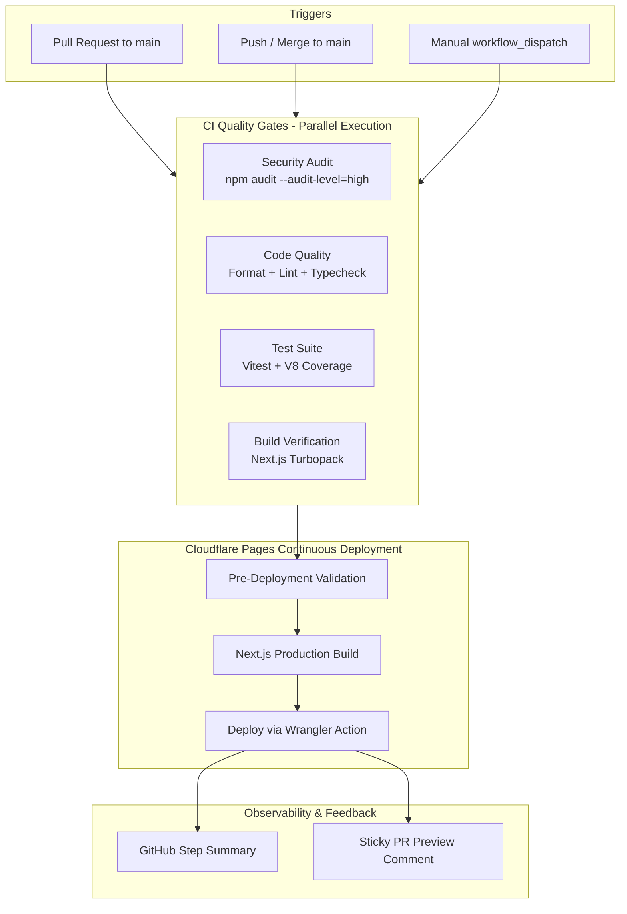
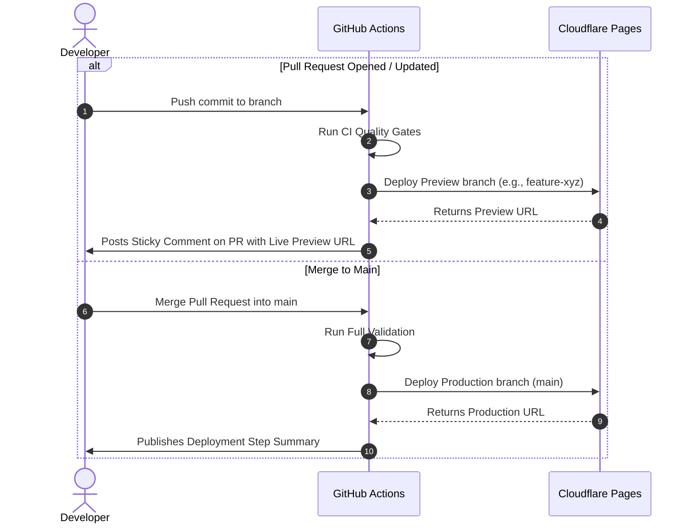

# CI/CD Pipeline Architecture & Deployment Guide

This document outlines the Continuous Integration and Continuous Deployment (CI/CD) architecture for the **Wassim AHMED Portfolio** application.

---

## 🏗️ Pipeline Architecture

The pipeline consists of two primary automated workflows in GitHub Actions:

1. **Continuous Integration (`ci.yml`)**: Executes on every push and pull request targeting `main` to enforce strict type safety, code formatting, linting, accessibility (WCAG 2.2), test coverage, security audits, and production bundling.
2. **Continuous Deployment (`deploy.yml`)**: Deploys isolated Preview environments for Pull Requests and releases to Production on merges to `main`.



---

## 🛡️ Quality Gates Breakdown

| Gate                   | Tool              | Command                        | Description                                                                        |
| :--------------------- | :---------------- | :----------------------------- | :--------------------------------------------------------------------------------- |
| **Security Audit**     | npm audit         | `npm audit --audit-level=high` | Scans dependencies for high and critical security vulnerabilities.                 |
| **Code Formatting**    | Prettier          | `npm run format:check`         | Verifies consistent code style across all TS, TSX, JSON, CSS, and Markdown files.  |
| **Linting & A11y**     | ESLint + jsx-a11y | `npm run lint`                 | Enforces React, Next.js, and WCAG 2.2 accessibility rules.                         |
| **Type Checking**      | TypeScript        | `npm run typecheck`            | Strict compiler verification (`tsc --noEmit`) catching prop and typing mismatches. |
| **Unit & Integration** | Vitest + RTL      | `npm run test:coverage`        | Runs unit/component tests and generates V8 code coverage reports.                  |
| **Production Build**   | Next.js           | `npm run build`                | Compiles production bundle with Edge runtime and static generation validation.     |

---

## 🚀 Cloudflare Pages Continuous Deployment

### Environment Routing



---

## 🔑 GitHub Secrets Configuration

To enable automated deployments to Cloudflare Pages, configure the following **Repository Secrets** in GitHub (`Settings -> Secrets and variables -> Actions`):

| Secret Name             |  Required  | Description                                            | Where to Find / Create                                                  |
| :---------------------- | :--------: | :----------------------------------------------------- | :---------------------------------------------------------------------- |
| `CLOUDFLARE_API_TOKEN`  |  **Yes**   | API token with Cloudflare Pages deployment permissions | Cloudflare Dashboard -> My Profile -> API Tokens -> Create Custom Token |
| `CLOUDFLARE_ACCOUNT_ID` |  **Yes**   | Your Cloudflare Account identifier                     | Cloudflare Dashboard -> Workers & Pages (right sidebar)                 |
| `GEMINI_API_KEY`        | _Optional_ | API key for external LLM fallback in chatbot           | [Google AI Studio](https://aistudio.google.com/)                        |

### Step-by-Step: Creating the Cloudflare API Token

1. Log in to the [Cloudflare Dashboard](https://dash.cloudflare.com/).
2. Navigate to **My Profile** > **API Tokens**.
3. Click **Create Token** and select **Create Custom Token**.
4. Configure the permissions:
   - **Account** > **Cloudflare Pages** > **Edit**
   - **Account** > **Account Settings** > **Read**
5. Set **Account Resources** to **Include** > `Your Account Name`.
6. Click **Continue to summary** and **Create Token**.
7. Copy the generated token and save it as `CLOUDFLARE_API_TOKEN` in GitHub Secrets.

---

## 💻 Local Developer Verification

Run the entire CI validation suite locally before pushing code:

```bash
# Run complete verification compound suite
npm run ci

# Run individual quality gates
npm run format:check   # Prettier format verification
npm run lint           # ESLint & JSX accessibility linting
npm run typecheck      # Strict TypeScript check
npm run test:coverage  # Vitest test suite with V8 coverage report
npm run build          # Next.js production build verification
```

### Git Hooks (Husky)

Husky pre-commit hooks are configured to run automatically on `git commit`:

- `lint-staged`: Formats code with Prettier and fixes auto-fixable ESLint issues on staged files.
- `typecheck`: Runs `tsc --noEmit`.
- `test`: Runs the Vitest test suite.

---

## 🔒 Recommended GitHub Branch Protection

To safeguard the `main` branch against regressions:

1. In GitHub, navigate to **Settings** > **Branches** > **Branch protection rules**.
2. Add a rule for `main`:
   - Check **Require a pull request before merging**.
   - Check **Require status checks to pass before merging**:
     - `Security Dependency Audit`
     - `Code Quality (Lint, Format, Types)`
     - `Unit & Component Tests with Coverage`
     - `Next.js Production Build Verification`
   - Check **Require branches to be up to date before merging**.
   - Check **Do not allow bypassing the above settings**.
